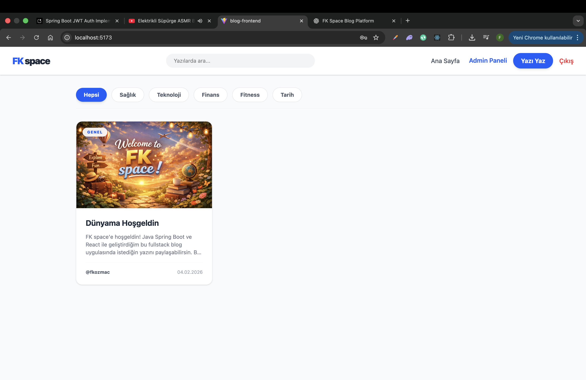
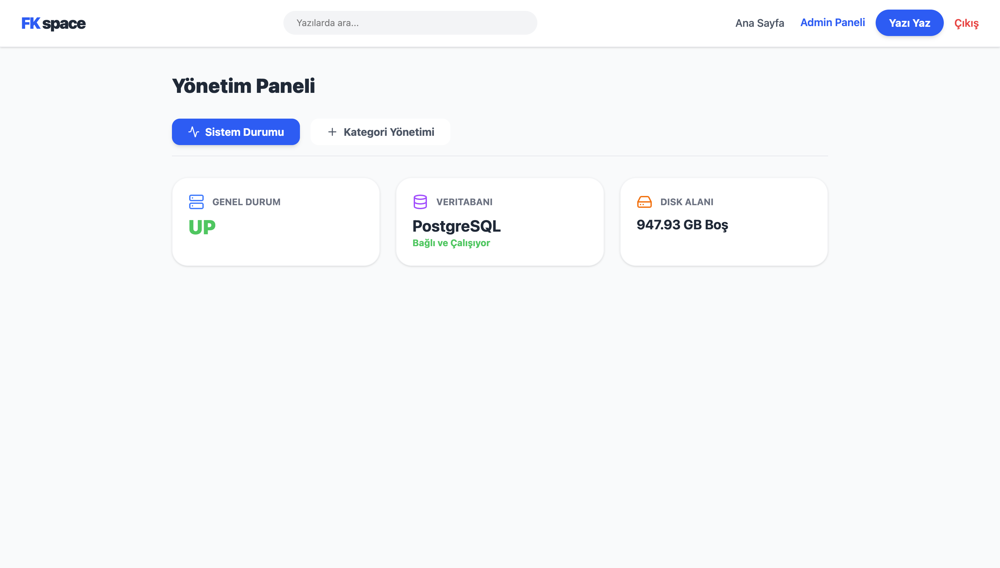
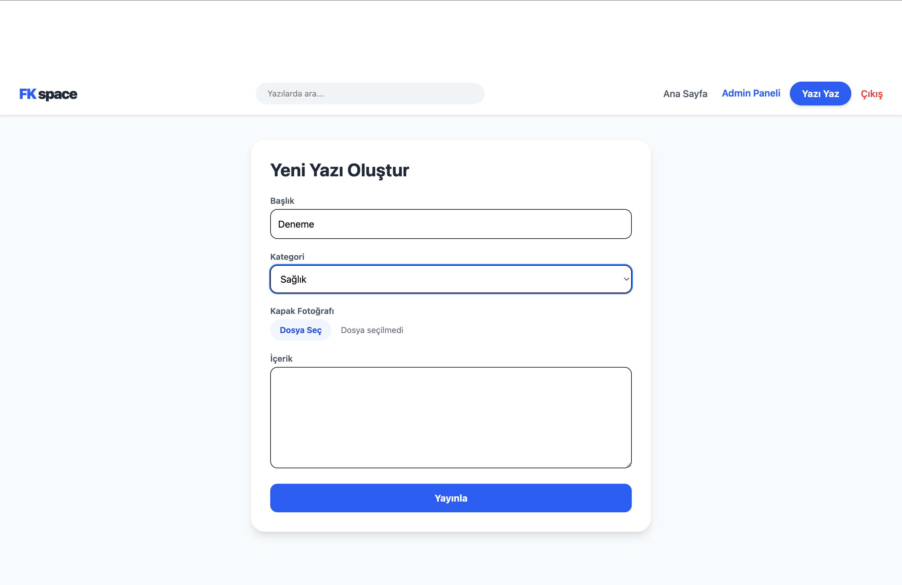
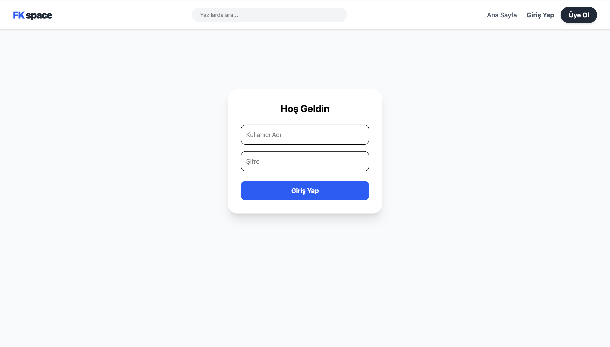
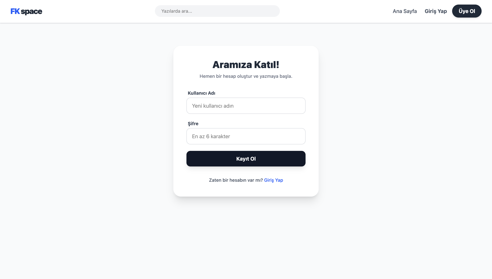

# 🪐 FK space | Full-Stack Blog Platform

FK space, **Spring Boot 3 (Java 21)** ve **React** kullanılarak geliştirilmiş, kurumsal standartlarda mimariye sahip, yüksek performanslı bir blog yönetim platformudur.  
Proje; güvenli kimlik doğrulama, veritabanı optimizasyonu, sistem izleme ve modern DevOps süreçlerini kapsayan tam donanımlı bir ekosistem sunar.

---

## 🚀 Temel Özellikler

- 🔐 **Zırhlı Kimlik Doğrulama**  
  JWT tabanlı stateless authentication.  
  Kısa ömürlü Access Token + veritabanı destekli uzun ömürlü Refresh Token yapısı.

- 🛠️ **Admin Dashboard & Sistem İzleme**  
  Spring Boot Actuator entegrasyonu ile:
  - Uygulama durumu (health)
  - Veritabanı bağlantısı
  - Disk kullanımı

- 🖼️ **Medya ve İçerik Yönetimi**
  - Dosya sistemine görsel yükleme
  - Dinamik kategori yönetimi
  - Zengin içerikli blog yazıları

- 🔍 **Akıllı Arama ve Filtreleme**
  - Başlık ve içerikte veritabanı seviyesinde arama (SQL LIKE)
  - Kategori bazlı dinamik filtreleme

- 💬 **Etkileşim & Yetkilendirme**
  - Kullanıcı yorum sistemi
  - Yazı ve yorumlar üzerinde Owner / Admin bazlı yetki kontrolü

---

## 🛠️ Teknik Mimari ve Standartlar

Proje geliştirilirken temiz mimari ve ölçeklenebilirlik ön planda tutulmuştur.

- **N+1 Problemi Çözümü**  
  Hibernate `@EntityGraph` kullanılarak ilişkili veriler (User, Category) tek sorguda çekilir.

- **Sunucu Taraflı Sayfalama**  
  `Pageable` yapısı ile büyük veri kümeleri bellek dostu şekilde sunulur.

- **DTO & Mapper Katmanı**  
  Entity’ler doğrudan dış dünyaya açılmaz.  
  Manuel mapper katmanı ile veri izolasyonu sağlanır.

- **Global Exception Handling**  
  `@RestControllerAdvice` ile tüm hata senaryoları merkezi olarak yönetilir ve standart JSON çıktısı döner.

- **Frontend Token Yönetimi**  
  Axios interceptor yapısı ile 401 durumlarında otomatik refresh token akışı çalışır.

---

## 📦 Teknoloji Yığını

### Backend
- Java 21
- Spring Boot 3.4
- Spring Security 6 (Stateless JWT)
- Spring Data JPA
- PostgreSQL
- Spring Boot Actuator
- Swagger / OpenAPI 3

### Frontend
- React 19 (Vite)
- Tailwind CSS v4
- Lucide React
- Axios

### DevOps
- Docker
- Docker Compose

---

## 🐳 Docker ile Kurulum

Tüm sistemi (PostgreSQL + Backend + Frontend) tek komutla ayağa kaldırabilirsiniz:

```bash
docker-compose up --build
```

Uygulama başarıyla başladıktan sonra:

- Frontend: http://localhost:5173  
- Backend API: http://localhost:8080/api  
- Swagger UI: http://localhost:8080/swagger-ui/index.html  

---

## 📸 Ekran Görüntüleri

### 🏠 Ana Sayfa


### 🛠 Admin Dashboard


### ✍️ İçerik / Yazı Oluşturma


### 🔐 Giriş Ekranı


### 📝 Kayıt Ekranı


---

## 🤝 İletişim

**Furkan Kozmaç**

- 💼 LinkedIn  
  https://www.linkedin.com/in/furkan-kozmac-5a980025b/

- 💻 GitHub  
  https://github.com/FurkanKozmac

- 📧 E-posta  
  fkozmac@gmail.com
